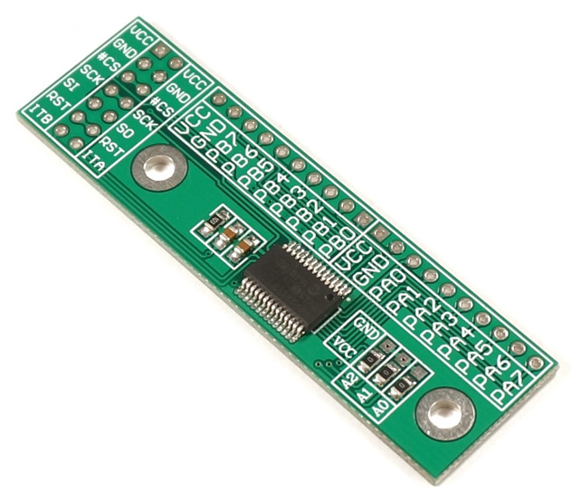

# MCP23S17

Arduino Library for the [MCP23S17 SPI IO expander](http://ww1.microchip.com/downloads/en/DeviceDoc/20001952C.pdf).

Note that this library *does not* work with the sister-chip MCP23017 which communicates over I2C.

Also note that the MCP23 chip family has its own 3 bit (8 value) addressing scheme, independent of either the SPI or I2C buses. What this means is:
 * You need to ensure you are accessing the correct address before communication will succeed
 * You can connect up to 8 MCP23 family devices on the same slave select line on the same bus

It seems some modules default to address `0`, and others default to address `1` (try these two addresses before trying any others).

## Sourcing

Various [Taobao pages](https://item.taobao.com/item.htm?id=557956934643) offer MCP23S17 modules such as this one, which defaults to address `0`.



## Wiring

 * Set up [SPI bus](https://www.arduino.cc/en/Reference/SPI) as usual.
   * Should you wish to connect multiple MCP23S17 then you will need to manually configure addresses if they are both:
     * On the same SPI bus; and
     * Share a slave select pin

## Background

The goal of this implementation is to provide a software interface that mimics the existing Arduino I/O functions:
 * `pinMode(pin, mode)`
 * `digitalWrite(pin, value)`
 * `digitalRead(pin)`

The class does include several more methods that can be used to simplify configuration in the same "Arduino-ish" way, methods for writing/reading 8-bit registers (configuration and I/O ports) at once, as well as writing/reading consecutive registers (allowing all 16 bits to be read or written with one method call). The interrupt features of the chip are not directly supported with method for specifically configuring them, however, the byte and word read/write methods may be used to configure and use the interrupt features. These features can get somewhat complicated, and any user prepared to use them will likely prefer the more generic methods for controlling them.

Upon initialization of an MCP23S17 as an object, ALL MCP23S17s on the SPI bus (sharing the same slave select) will be placed into hardware addressing mode. This allows up to 8 MCP23S17s to be used with a single slave select.

## Methods

### MCP()

Instantiate an MCP23S17 device as an object.

```
MCP object_name(address, slave_select)
```

 * `object_name`: any arbitrary name given to create the object
 * `address`: address (0-7) of the device configured with address (pins A0, A1, A2)
 * `slave_select`: a valid *Arduino* pin number.

#### Returns

Nothing.

#### Example

```
MCP onechip(1, 10);    // create an object at address 1 called "onechip", using pin 10 as slave select
MCP twochip(2, 10); // create an object at address 2 called "twochip", using pin 10 as slave select
```

### pinMode()

Configures pin(s) as either input or output on the selected object (device specified by an address).

```
object.name.pinMode(pin, mode);
```
or
```
object.name.pinMode(mode);
```

 * `pin`: the pin number (1-16) on which to set as input or output
 * `mode`: if a pin is specified, either a "HIGH" (1) for input (default) or a "LOW" (0) for output. If a pin is not specified, mode should be a word indicating the mode of each of the 16 I/O pins on the chip.

#### Returns

Nothing.

#### Example

```
void setup() {
  onechip.pinMode(4, HIGH);            // set pin 4 as an input
  onechip.pinMode(16, LOW);            // set pin 16 as an output
  twochip.pinMode(0B0000111100001111); // set pins 1-4 and 9-12 as input, 5-8 and 13-16 as output
}
```

### pullupMode()

Configure the weak pull-up resistors on pins defined as inputs.

This has no effect on pins that are configured as outputs.

```
object_name.pullupMode(pin, mode);
```
or
```
object_name.pullupMode(mode);
```

 * `pin`: the pin number (1-16) on which to enable or disable the internal weak pull-up resistor
 * `mode`: if a pin is specified, either "HIGH" (1) to enable or "LOW" (0) to disable (default) the weak pull-up resistor on the specified pin. If a pin is not specified, mode should be a word indicating the pull-up mode of each of the 16 pins on the chip. Configuring pull-up has no effect on pins while they are configured as output.

#### Returns

Nothing.

#### Example

```
void setup() {
  onechip.pullupMode(4, HIGH);            // enable the pull-up on pin 4
  twochip.pullupMode(0B0000111100000000); // enable the pull-ups on pins 9-12
}
```

### inputInvert()

Configure inversion on pins configured as inputs.

This will cause an inverted input pin to read as "LOW" (`0`) when it is actually in a high state, or as "HIGH" (`1`) when it is actually in a low state. This has no effect on pins that are configured as outputs.

```
object_name.inputInvert(pin, inversion);
```
or
```
object_name.inputInvert(inversion);
```

 * `pin`: the pin number (1-16) on which to set or clear inversion
 * `inversion`: if a pin is specified, either "HIGH" (1) is specified to enable, or "LOW" (0) to disable (default) inversion on the specified pin. If a pin is not specified, mode should be a word indicating the inversion state of each of the 16 pins on the chip. Configuring inversion has no effect on pins while they are configured as output.

#### Returns

Nothing.

#### Example

```
void setup() {
  onechip.inputInvert(4, LOW);             // disable inversion on pin 4
  twochip.inputInvert(0B0000000000001111); // enable inversion on pins 1-4
}
```


### digitalWrite()

Write a "HIGH" or "LOW" value to a digital I/O pin(s).

```
object_name.digitalWrite(pin, value);
```
or
```
object_name.digitalWrite(value);
```

 * `pin`: the pin number (1-16) on which to set the value
 * `value`: if a pin is specified, either a "HIGH" (1) or a "LOW" (0) value may be set on the specified pin. If a pin is not specified, value should be a word indicating the output state of all 16 pins on the device. Writing pins configured as inputs has no effect.

#### Returns

Nothing.

#### Example

```
void loop() {
  onechip.digitalWrite(16, HIGH);           // set pin 16 to "HIGH"
  twochip.digitalWrite(0B1100000000110000); // set 5, 6, 15 & 16 to high, and 7, 8, 13 & 14 to low - inputs ignored
}
```


### digitalRead()

Reads the value of input pin(s), either "HIGH" ("1") or "LOW" ("0).

```
object_name.digitalRead(pin);
```
or
```
object_name.digitalRead();
```

 * `pin`: the pin number (1-16) whose value will be read. If no pin number is supplied, a word will be read containing the input state of all pins. The values for pins configured as output should be disregarded if the "word-mode" version is used.

#### Returns

 * "HIGH" (1) or "LOW" (0) if a pin is supplied.
 * A word (16 bits) is returned if no pin argument is given

#### Example

```
void loop() {
  int onevalue;
  int twovalue;
       
  onevalue = onechip.digitalRead(4); // assigns the value of pin4 to onevalue
  twovalue = twochip.digitalRead(); // assigns the value of all 16 I/O pins to twovalue
}
```


### wordWrite()

Advanced method to write a register pair in the MCP23S17. This class operates the MCP23S17 in "BANK=0" mode. The intention is that a registers for both ports may be written by supplying a single word as an argument. The low byte is written to the register address supplied, and the high byte to the next higher register address.

```
object_name.wordWrite(base_register, value);
```

 * `base_register`: the beginning register address to write, for example, if 0x02 is given, the low byte of "value" will be written to 0x02 and the high byte of "value" to the register at 0x03
 * `value`: a word (unsigned int) that will be broken into two bytes and written to two consecutive registers, starting with the `base_register` address

#### Returns

Nothing.

#### Example

```
void loop() {
  onechip.wordWrite(0x12, 0xFF00); // Set GPIOA to 0x00 and GPIOB to OxFF
}
```

### byteWrite()

Advanced method to write any single register in the MCP23S17.

```
object_name.byteWrite(register, value);
```

 * `register`: the register address to write
 * `value`: a byte (unsigned char) that will be written to the specified registers
	
#### Returns

Nothing.

#### Example

```
void loop() {
  twochip.byteWrite(0x13, 0xF0); // Set GPIOB (portB) to 0xF0 (0B11110000) 
}
```


### byteRead()

Advanced method to read any single register in the MCP23S17.

```
object_name.byteRead(register);
```

 * `register`: the register address to be read

#### Returns

unsigned char (uint8_t)

#### Example

```
void loop() {
  int twovalue;
  twovalue = twochip.byteRead(0x12); // Read GPIOA (portA)
}
```

## Complete example

```
// configure two chips with the same slave select (differentiated by address)
MCP onechip(1, 10); // create an object at address 1 called "onechip", using pin 10 as slave select
MCP twochip(2, 10); // create an object at address 2 called "twochip", using pin 10 as slave select
   		 	
void setup() {
  onechip.pinMode(4, HIGH);                // sets onechip's pin 4 as an input
  onechip.pinMode(16, LOW);                // sets onechip's pin 16 as an output
  twochip.pinMode(0B0000111100001111);     // sets twochip's pins 1-4 and 9-12 as input, 5-8 and 13-16 as output
    
  onechip.pullupMode(4, HIGH);             // enable the pull-up on onechip's pin 4
  twochip.pullupMode(0B0000111100000000);  // enable the pull-ups on twochip's pins 9-1
				
  onechip.inputInvert(4, LOW);             // disable inversion on onechip's pin 4
  twochip.inputInvert(0B0000000000001111); // enable inversion on twochip's pins 1-4
}

void loop() {
  int onevalue;
  int twovalue;
	
  onechip.digitalWrite(16, HIGH); // set pin 16 to "HIGH"	
  twochip.digitalWrite(0B1100000000110000); // Set 5, 6, 15 & 16 to high, 7,8, 13 & 14 to low - inputs ignored
	
  onevalue = onechip.digitalRead(4); // assigns the value of pin4 to onevalue
  twovalue = twochip.digitalRead(); // assigns the value of all 16 I/O pins to twovalue
	
  /* These are for context only - use them only if you really know what you're doing
  onechip.wordWrite(0x12, 0xFF00); // Set GPIOA to 0x00 and GPIOB to OxFF
  twochip.byteWrite(0x13, 0xF0); // Set GPIOB (portB) to 0xF0 (0B11110000)
  twovalue = twochip.byteRead(0x12); // Read GPIOA (portA)
  */
}
```
